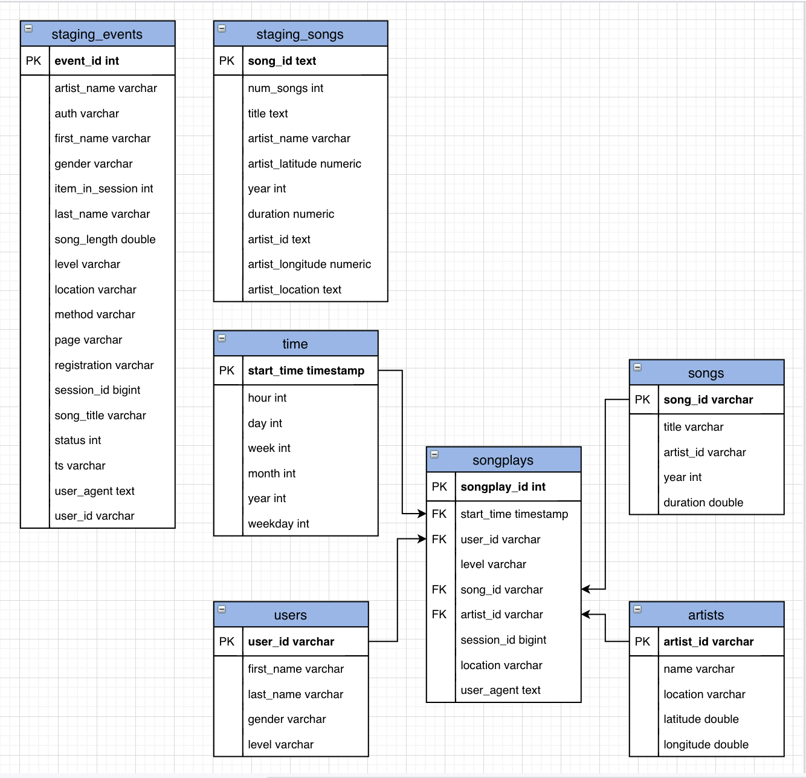

# Data Warehouse
## Introduction
A music streaming startup, *Sparkify*, has grown their user base and song database and wants to move their processes and data onto the cloud. Their data resides in S3, in a directory of JSON logs on user activity on the app, as well as a directory with JSON metadata on the songs in their app.

## Project Description
The data engineer is tasked with building an ETL pipeline that extracts their data from S3, stages them in Redshift, and transforms data into a set of dimensional tables for their analytics team to continue finding insights in what songs their users are listening to.

## Datasets
There are two datasets that reside in S3:
- Song data: `s3://udacity-dend/song_data`
- Log data: `s3://udacity-dend/log_data`

Log data json path: `s3://udacity-dend/log_json_path.json`

### Song Dataset
The first dataset is a subset of real data from the [Million Song Dataset](http://millionsongdataset.com). Each file is in JSON format and contains metadata about a song and the artist of that song. The files are partitioned by the first three letters of each song's track ID.

Example filepaths:
```
song_data/A/B/C/TRABCEI128F424C983.json
song_data/A/A/B/TRAABJL12903CDCF1A.json
```

Example song file content:
```{"num_songs": 1, "artist_id": "ARJIE2Y1187B994AB7", "artist_latitude": null, "artist_longitude": null, "artist_location": "", "artist_name": "Line Renaud", "song_id": "SOUPIRU12A6D4FA1E1", "title": "Der Kleine Dompfaff", "duration": 152.92036, "year": 0}
```

### Log Dataset
The second dataset consists of log files in JSON format generated by this [event simulator](https://github.com/Interana/eventsim) based on the songs in the dataset above. These simulate app activity logs from an imaginary music streaming app based on configuration settings.

The log files in the dataset are partitioned by year and month.

Example filepaths:
```
log_data/2018/11/2018-11-12-events.json
log_data/2018/11/2018-11-13-events.json
```

### Schema for Project
Using the song and event datasets, this star schema is used for optimized queries on song play analysis.



This includes the following tables:
**Fact Table**
- **songplays** - records in event data associated with song plays (i.e. records with page `NextSong`)

**Dimension Tables**
- **users** - users in the app
- **songs** - songs in music database
- **artists** - artists in music database
- **time** - timestamps of records in **songplays** broken down into specific time units

### Project Template
There are a few important files in this project:
- `create_tables.py` - where fact and dimension tables are created for the star schema in Redshift
- `etl.py` - where data is loaded from S3 into staging tables on Redshift and then processed into analytics tables that are also on Redshift
- `sql_queries.py` - where SQL queries are defined and imported into the two files above
